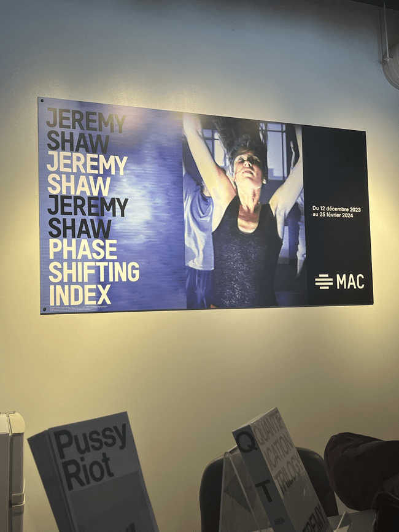
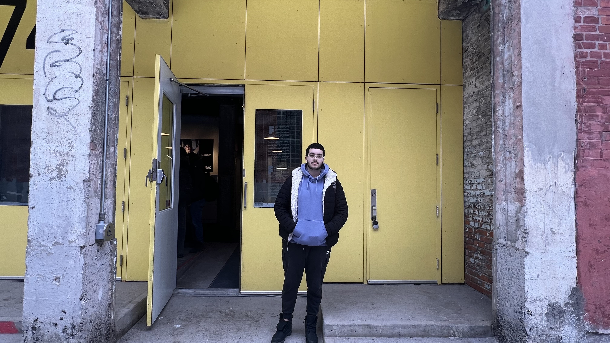
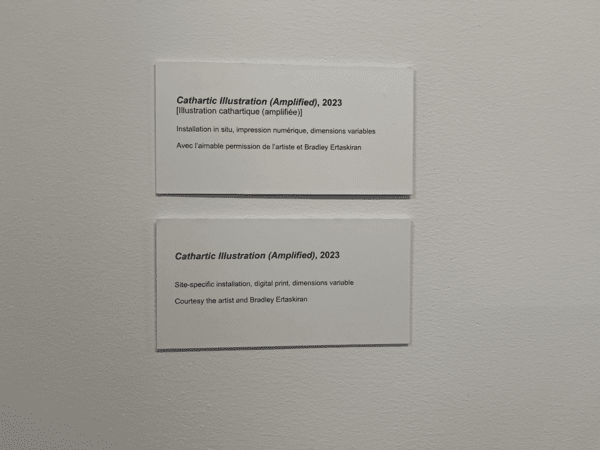
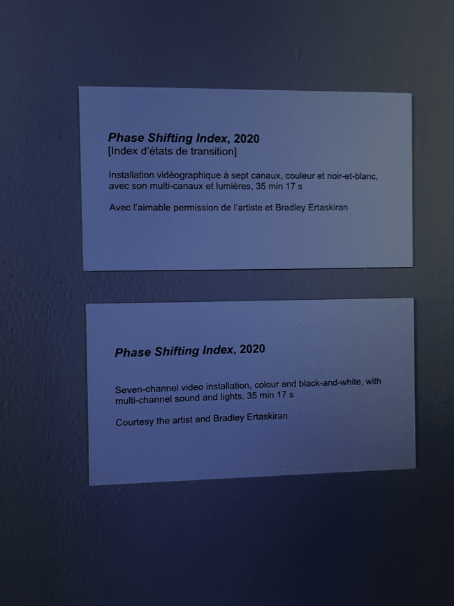

## TP01 Exposition Jeremy Shaw, Phase Shifting index ##

### Informations sur l'exposition ###

Le nom de l'exposition est Jeremy Shaw, Phase Shifting index.

Elle a été présenté à la fonderie Darling.

L'exposition est une exposition temporaire ce qui veut dire qu'à un certain moment elle ne sera plus ou je l'ai vu.

Je suis allé visiter l'exposition le 24 Janvier 2024, le titre de l'oeuvre est: Phase Shifting index, réaliser par Jeremy Shaw en 2020.

### Description de l'oeuvre ###

Vaste installation vidéo immersive à sept canaux, Phase Shifting Index [Index d’états de transition] est une rêverie parascientifique exaltante d’une grande ambition intellectuelle et artistique, et le point culminant des travaux récents de Shaw. Dans ce qui semble être une étude anthropologique d’un futur lointain, une narration commente de manière rétrospective l’émergence de nouvelles réalités déconcertantes sur sept écrans affichant ce qui s’avère être des images d’archives de divers groupes de thérapie par le mouvement des années 60 aux années 90. Ces images sont captées dans les formats de l’époque – allant du film 16 mm au VHS en passant par le Hi-8. 

#### Source: https://fonderiedarling.org/Phase-Shifting-Index

Cette exposition est une exposition de type contemplative, parce que l'experience est visuelle. Il faut qu'on regarde l'oeuvre pour l'admirer et la comprendre. 
